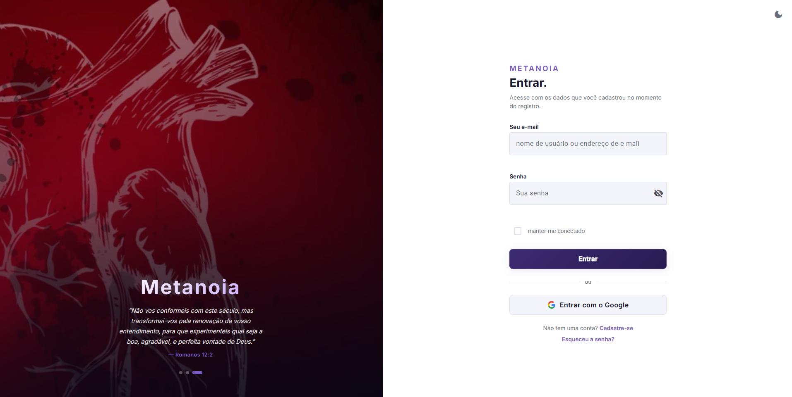
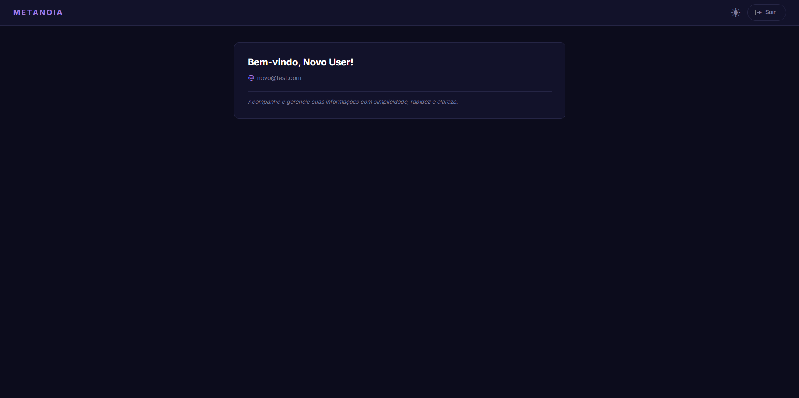
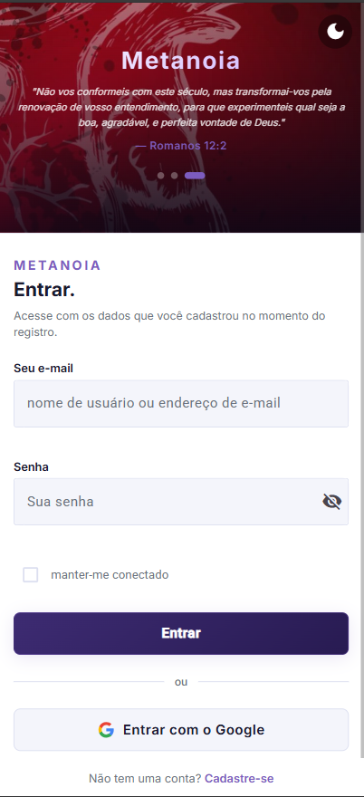
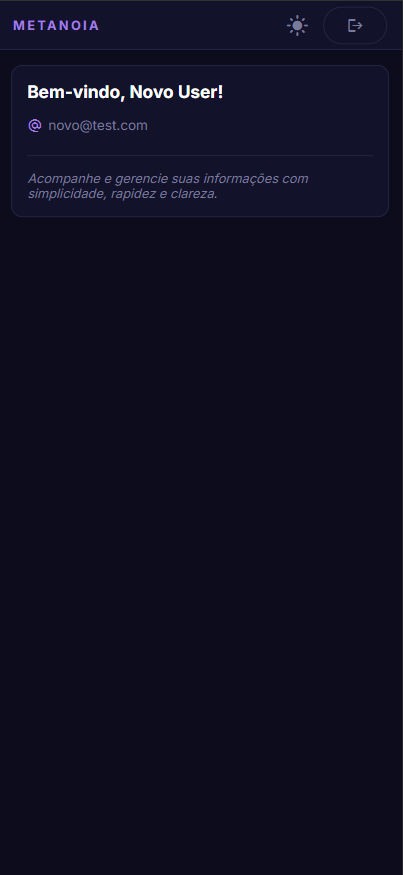

# Metanoia — Login

Interface de autenticação completa, responsiva e acessível, construída com Angular 19 seguindo as melhores práticas modernas do framework.

<p align="center">
  
  
  
  
  
  
  
  
</p>

## Preview

### Desktop

<p align="center">
  
  
</p>

### Mobile

<p align="center">
  
  
</p>

## Funcionalidades

- **Login** com e-mail e senha, opção "manter-me conectado" (localStorage vs sessionStorage)
- **Cadastro** com nome, data de nascimento, telefone, e-mail e senha com confirmação
- **Recuperação de senha** via e-mail
- **Autenticação SSO** com Google (Google Identity Services)
- **Dashboard** protegido, exibindo dados do usuário autenticado
- **Tema dark/light** com persistência no localStorage
- **Carousel** automático no painel hero com navegação por dots
- **Guards** de rota: `authGuard` (protege páginas autenticadas) e `guestGuard` (redireciona usuários logados)
- **Interceptor HTTP** que injeta o Bearer token em todas as requisições
- **Servidor mock** para desenvolvimento local (sem backend real)

## Padrões Angular 19

- Standalone components (sem NgModules)
- Signals (`signal`, `computed`, `effect`)
- `input()` / `output()` APIs
- `inject()` em vez de constructor injection
- `takeUntilDestroyed()` para gerenciamento de subscriptions
- `ChangeDetectionStrategy.OnPush` em todos os componentes
- Functional guards e interceptors
- Lazy loading em todas as rotas
- `NonNullableFormBuilder` com reactive forms

## Como usar

### Credenciais de teste (mock)

| E-mail | Senha |
|---|---|
| `teste@metanoia.com` | `12345678` |
| `novo@test.com` | `12345678` |

### Google SSO

Para habilitar o botão "Entrar com o Google", configure o Client ID em `src/environments/environment.ts`:

```ts
export const environment = {
  googleClientId: 'SEU_CLIENT_ID.apps.googleusercontent.com',
};
```

Gere o Client ID em: [console.cloud.google.com/apis/credentials](https://console.cloud.google.com/apis/credentials)

## Estrutura do Projeto

```
mock/
├── db.json          # dados do servidor mock (usuários, etc.)
└── server.js        # configuração do JSON Server
src/
└── app/
    ├── core/
    │   ├── guards/          # authGuard, guestGuard
    │   ├── interceptors/    # auth interceptor (Bearer token)
    │   └── services/        # StorageService, ThemeService
    ├── features/
    │   ├── auth/
    │   │   ├── components/  # login-form, register-form, forgot-password-form,
    │   │   │                #   google-sso-button, auth-layout
    │   │   ├── constants/
    │   │   ├── models/
    │   │   ├── pages/       # login-page, register-page, forgot-password-page
    │   │   └── services/    # AuthService, GoogleSsoService
    │   └── dashboard/
    └── shared/
        ├── components/      # form-header, password-field
        └── validators/      # password validators
```

## Como rodar o projeto

### Pré-requisitos

- [Node.js](https://nodejs.org) 20+
- [npm](https://npmjs.com) 10+

### Instalação

```bash
npm install
```

### Rodar o servidor mock (API local)

```bash
npm run mock:server
```

> Inicia o servidor em `http://localhost:3000`

### Rodar a aplicação Angular

```bash
npm start
```

> Abre em `http://localhost:4200`

### Rodar os dois juntos (Windows)

```bash
npm run start:full
```

### Build de produção

```bash
npm run build
```